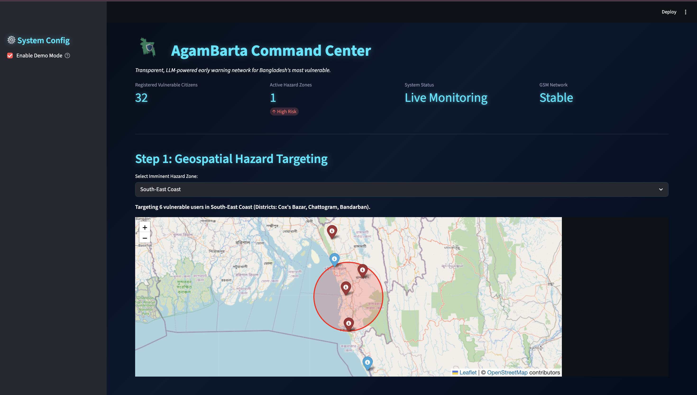
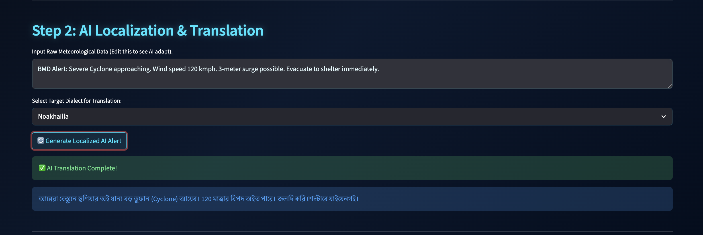
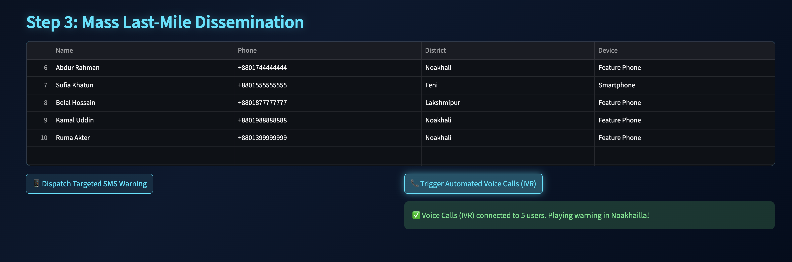

AgamBarta AI: Geospatial and LLM Powered Command Center for Early Warning Dissemination in Bangladesh
Project Overview

AgamBarta AI is a specialized disaster management dashboard designed to bridge the last mile gap in early warning systems. While modern weather forecasting is improving, many marginalized communities in Bangladesh still rely on basic feature phones and face difficulties understanding complex technical language.

This system enables disaster officials to target specific geographic hazard zones, use artificial intelligence to translate complex weather bulletins into simple local dialects, and broadcast alerts directly to basic phones via SMS and automated voice calls.

The Problem
Complex Language: Official meteorological bulletins often use formal language that is difficult for rural communities to comprehend.
Technological Barrier: A significant portion of the vulnerable population does not own a smartphone and lacks consistent internet access.
Ineffective Targeting: Dissemination often lacks the precision to alert only those people who are physically located in an identified danger zone.
The Solution

AgamBarta AI provides a three-step command center:

Step 1: Geospatial Hazard Targeting

Officials use an interactive map of Bangladesh to select a hazard region. The system automatically filters a database of registered citizens to identify those living in the danger zone.

Step 2: AI Localization

The system takes raw weather data and uses Large Language Models to rewrite the information into conversational regional dialects. Supported dialects include Chittagonian, Noakhailla, Barishali, Sylheti, and Rangpuri.

Step 3: Targeted Dissemination

Once the message is simplified, it is sent via the GSM network using two methods:

SMS: For quick reading on any mobile phone
IVR Voice Calls: An automated AI voice calls the user and reads the warning out loud, which is essential for citizens who face literacy challenges

Tech Stack
Frontend: Streamlit with Glassmorphism UI
Mapping: Folium and Streamlit Folium
Data Handling: Pandas
AI Engine: OpenAI API with custom prompt logic
Communication: Twilio Programmable SMS and Voice API
How to Run Locally

Clone this repository to your computer.

Install the necessary libraries:

pip install streamlit pandas folium streamlit-folium openai twilio

Run the application:

streamlit run app.py

Note: The application includes a Demo Mode toggle that simulates the AI and Twilio responses, allowing for testing and demonstration without requiring paid API keys.

Impact

By combining geospatial intelligence with inclusive telecommunications, AgamBarta AI ensures that life-saving early warnings reach the absolute last mile, helping to protect lives and livelihoods across disaster-prone regions in Bangladesh.
